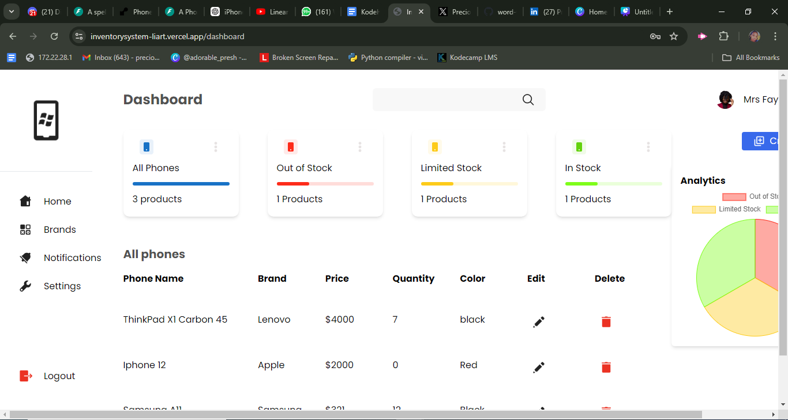

# Backend(Python FastAPI) Developer 

#### Skills and Technologies
- <b>Programming Languages: Python, Python Tkinter</b>
- <b>Frameworks: FastAPI<b/>
- <b>Databases: PostgreSQL<b/>
- <b>Tools: Git, Postman<b/>

## Work Experience
**Backend Intern @ KodeHauz Solutions Planets (_October 2024 - still date_)**

- Contributed to the creation of scalable APIs and backend systems written in Python using FastAPI.
  
- Worked with cross-functional team (mobile, frontend, UI/UX designers and DevOps developers) to implement essential features of gaming project.
  
- Worked on the workflow of structures for the storage of game history of the users, in order to optimize data retrieval and management.
  
- Have participated in code reviews and contributed to improving code quality and process improvements.
  
- Developed task prioritization and teamwork experience in a high-pressure academic environment.

**IT(Industrial Training) student @ KodeHauz Solutions Planets (_March 2024 - August 2024_)**

- Developed an inventory management system for a car store, improving data processing speed and operational efficiency.
  
- Worked on integrating Paystack for payment processing, allowing seamless handling of transactions via bank cards, resulting in a more secure and efficient payment flow.
  
- Developed a Phone Inventory System api consumed by the frontend 
  
- Developed an Attendance Management System (AMS) API consumend by the frontend 
  
- Developed games(Snake games, Ping_Pong game, Turtle Racing game) using python tkiner

## Projects
### Phone-Inventory-System-API
[Phone Inventory System Swagger Documentation](https://phone-inventory-system-api.onrender.com/docs)

Developed a Phone Inventory System api using **Python FastAPI**. The Phone Inventory System is designed to optimize inventory management and ensure accurate stock tracking. The Api was consume by the frontend team to develop the UI

[Phone Inventory system Dashboard ](https://inventorysystem-liart.vercel.app/dashboard)

- <b>Key Features:
  - User authentication,
  - CRUD operations for phones
  - CRUD operations for users<b/>

- <b>Technologies:
  - Python
  - FastAPI
  - PostgreSQL
  - postman
  - Render<b/>
  

### Personal Portfolio API
[Github Repository link](https://github.com/Precious-Udoibok/Personal-Portfolio-API)

The Personal Portfolio API is a powerful backend solution built with FastAPI to manage a personal portfolio website. 
<b>It provides a robust set of features for handling:
<ol>
<li>Projects: Create, update, delete, and view your projects.</li>
<li>Blog Posts: Manage blog content with endpoints to add, edit, delete, and retrieve posts.</li>
<li>Contact Information: Store and manage contact details with secure access.</li>
</ol><b/>

- <b>Technologies: 
   - Python
   - FastAPI
   - postman
   - SQLlite<b/>

### Word-Wiz API
[Word-Wiz-API Swagger Documentation ](https://word-wiz-be-bsws.onrender.com/docs)

Word Wiz is a Spelling Application API, built as a group project is a FastAPI-based backend service designed to help users improve their spelling skills. 
The application provides endpoints for various features, including:<b> Authentication, Blogs, Payments, Text-to-speech, Profile-picture,contact_us</b>

I was responsible for implementing key components such as <b>payments, authentication, and the voice-to-text functionality<b/>

The api was consumed by both the frontend and the mobile app development team

[Word-Wiz-Website ](https://word-wiz-fe.vercel.app/)

- <b>Key Features:
  - User Authentication
  - Payment Processing
  - Audio File Processing
  - Word Quizzes
  - Progress Tracking<b/>
  
- <b>Technologies:
  - Python, FastAPI
  - Speech-to-Text API integration
  - SQLAlchemy
  - Paystack API
  - postman
  - SQLite/PostgreSQL
  - Render<b/>

### ATTENDANCE MANAGAEMENT SYSTEM API (AMS)
[AMS Swagger Documentation ](https://attendance-management-system-api.onrender.com/docs)

This API was developed using **Python FastAPI** to manage employee attendance efficiently.The api was consumed by the frontend to developed the website
- <b> It includes many key features:
  - User Authentication(Signup/Login)
  - Profile picture upload
  - Attendance report: This report provides a comprehensive overview of employee attendance, detailing check-in and check-out times, work hours and break hours.
  - Account details: More information about the user<b/>

- <b>Technologies:
  - Python, FastAPI
  - cloudinary
  - SQLAlchemy
  - postman
  - SQLite/PostgreSQL
  - Render<b/>

## Contact Information 
- Phone Number: <b>08141859248</b>
- Email: <b>preciousudoibok@gmail.com</b>
- LinkedIn: [LinkedIn ](https://www.linkedin.com/in/precious-udoibok-b571b7306/)
- Twitter: [Twitter Handle ](https://x.com/adorable_presh)
